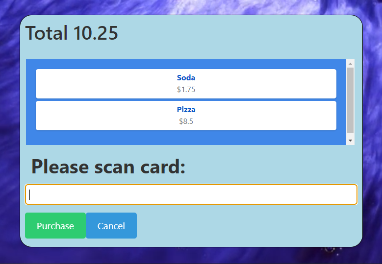

# OpenPOS

OpenPOS is a versatile and adaptable point-of-sale application built primarily in TypeScript, with additional styling and structure provided by CSS and HTML. OpenPOS is designed to serve the needs of diverse retail environments and can be customized to fit specific business requirements.

## Table of Contents

- [Features](#features)
- [Screenshots](#screenshots)
- [Getting Started](#getting-started)
- [Usage](#usage)
- [Contributing](#contributing)
- [License](#license)
- [Contact](#contact)

## Features

- **Point-of-Sale Operations**: Comprehensive functionality to cover typical retail transactions.
- **Customizability**: Highly adaptable to suit a variety of business needs.
- **Modern Technologies**: Built using TypeScript, CSS, and React.
- **Server-side User Authentication**: A secure solution for authenicating user and their logins, as well as checkouts

## Screenshots




## Getting Started

Before you start using OpenPOS, you need to get it onto your computer. This involves cloning the repository from GitHub.
```git clone https://github.com/ReeseHatfield/OpenPOS.git```

## Usage

After cloning the repo, you'll need to host the server that handles user authentication, card verifcation, and other misc utilities. Start by running the ```server_start.bat``` or ```server_start.sh``` on Linux/Mac or Windows respectively. Then run ```npm run electron-start``` in the ```/app``` directory. This will host OpenPOS in a web browser and desktop app, for whatever your use-case may be.

## License
[License](https://github.com/ReeseHatfield/OpenPOS/blob/main/LICENSE)

## Contributing

If you're interested in contributing to OpenPOS, please follow these steps:

1. Fork the repository.
2. Create your feature branch (`git checkout -b feature/AmazingFeature`).
3. Commit your changes (`git commit -m 'Add some AmazingFeature'`).
4. Push to the branch (`git push origin feature/AmazingFeature`).
5. Open a pull request.


## Contact

*hatfield.69@wright.edu*

Please feel free to contribute, and contact me with any questions or issues.
